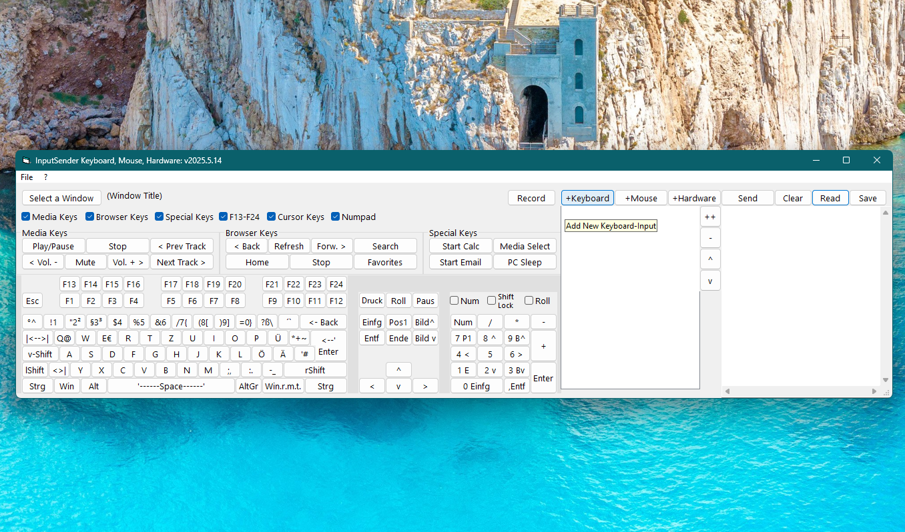

# Sys_InputSender  
## Sending keystrokes, mouse-moves or mouse-clicks to the active window  

 

Project started in april 2025.  
This example shows how to use the API [SendInput](https://learn.microsoft.com/en-us/windows/win32/api/winuser/nf-winuser-sendinput) for sending keystrokes or mouseevents to the active window.
It uses the udt-pointer method in a otherwise fully object oriented environment in VBC, just like you would use a pointer to a structure in other languages (like C).  
The udt-pointer method for VB was invented by me and published at ActiveVB in 2008.  

